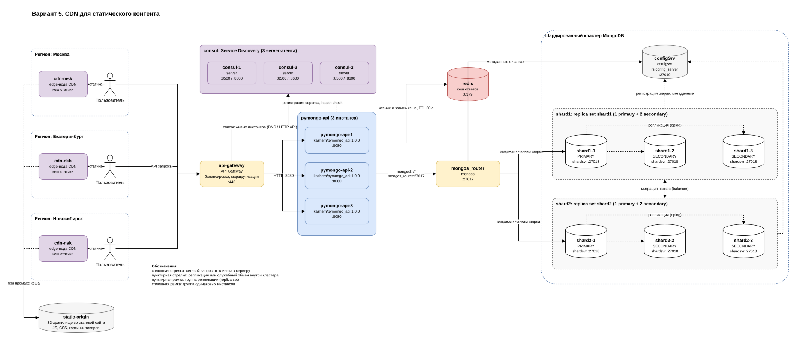

# Проектная работа 4 спринта: «Мобильный мир»

Стенд онлайн-магазина: приложение `pymongo-api` и MongoDB. Исходный вариант из одного
инстанса приложения и одной ноды MongoDB не выдержал распродажу. В работе к нему добавлены
шардирование, репликация и кеширование, а на схемах ещё балансировка через API Gateway
с Consul и CDN.

## Что где лежит

| Путь | Содержимое |
| :- | :- |
| [mongo-sharding](mongo-sharding) | задание 2: два шарда, config server, mongos |
| [mongo-sharding-repl](mongo-sharding-repl) | задание 3: каждый шард это replica set из трёх нод |
| [sharding-repl-cache](sharding-repl-cache) | задание 4: то же плюс redis, итоговый стенд для проверки |
| [schemas/black-friday.drawio](schemas/black-friday.drawio) | задания 1, 5, 6: пять вариантов схемы на отдельных страницах, итоговый на последней |
| [docs/architecture.md](docs/architecture.md) | задания 7 до 10: схемы коллекций и шард-ключи, горячие шарды, чтение с реплик, миграция на Cassandra |

Исходный стенд с одной нодой MongoDB остался в корне: `compose.yaml` и `scripts/mongo-init.sh`.

## Как запустить итоговый стенд

Нужен Docker с Docker Compose, минимум 2 CPU и 4 ГБ памяти. Образы: `kazhem/pymongo_api:1.0.0`,
`mongo:8`, `redis:8`.

```shell
cd sharding-repl-cache
docker compose up -d
./scripts/mongo-init.sh
```

Скрипт инициализирует replica set config server и обоих шардов, добавляет шарды в кластер
через mongos, включает шардирование коллекции `somedb.helloDoc` по хешу `_id`, вставляет
1000 документов и в конце печатает состав каждого replica set и количество документов
на каждом шарде.

Состав стенда:

| Сервис | Роль |
| :- | :- |
| `configSrv` | config server, порт 27019 |
| `shard1-1`, `shard1-2`, `shard1-3` | replica set `shard1`, порт 27018 |
| `shard2-1`, `shard2-2`, `shard2-3` | replica set `shard2`, порт 27018 |
| `mongos_router` | mongos, порт 27017, точка входа приложения |
| `redis` | кеш ответов, порт 6379 |
| `pymongo_api` | приложение, порт 8080 |

## Как проверить

Статус контейнеров, все должны быть `Up`, у нод MongoDB и redis `healthy`:

```shell
docker compose ps
```

Приложение: http://localhost:8080. В JSON-ответе:

- `mongo_topology_type` равен `Sharded`;
- `shards` содержит оба шарда, у каждого перечислены три ноды;
- `collections.helloDoc.documents_count` равен 1000;
- `cache_enabled` равен `true`.

Скорость кеша, три запроса подряд к `/helloDoc/users`:

```shell
./scripts/cache-check.sh
```

Первый запрос идёт в MongoDB и занимает больше секунды, второй и третий отдаются
из redis за единицы миллисекунд.

Документация API: http://localhost:8080/docs. Команды для проверки кластера
вручную, состав replica set, документы по шардам, распределение чанков,
описаны в [sharding-repl-cache/README.md](sharding-repl-cache/README.md).

Остановить стенд вместе с данными:

```shell
docker compose down -v
```

## Схема итогового решения

Исходник: [schemas/black-friday.drawio](schemas/black-friday.drawio), страница «Вариант 5».


