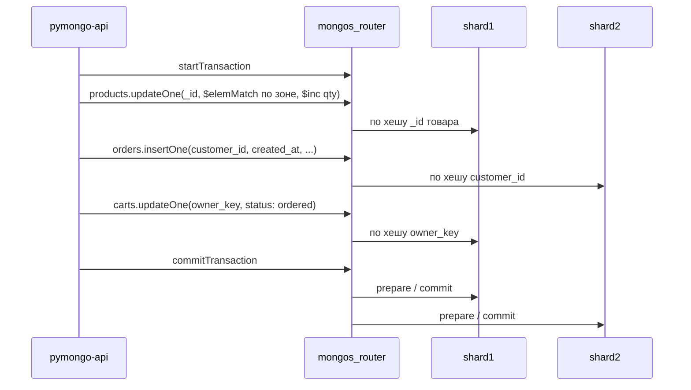
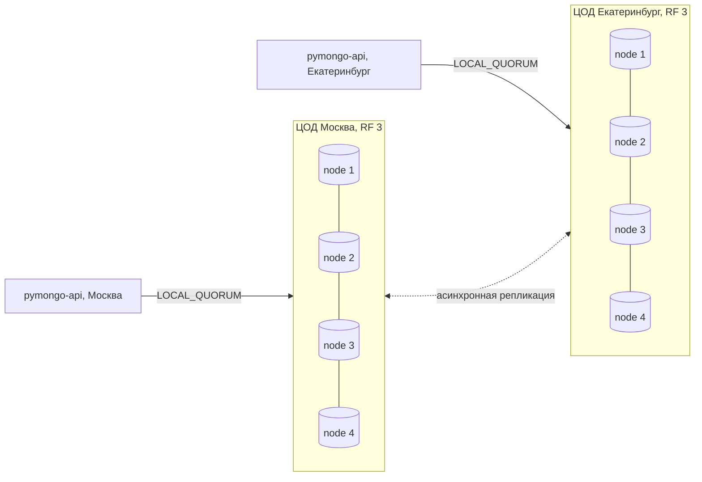

# Архитектура данных «Мобильного мира»

### Автор: Vladislav

### Дата: 20.09.2026

Документ покрывает задания 7 до 10 проектной работы: схемы коллекций MongoDB и выбор
шард-ключей, выявление и устранение горячих шардов, правила чтения с реплик и модель
данных для миграции на Cassandra.

Кластер MongoDB, для которого проектируются коллекции, описан в директории
[sharding-repl-cache](../sharding-repl-cache): два шарда, каждый replica set из трёх нод,
config server и mongos. Число шардов в примерах не принципиально, решения рассчитаны
на рост числа шардов.

Команды MongoDB из документа проверены на стендах `mongo-sharding` и `mongo-sharding-repl`
из этого репозитория, MongoDB 8. Команды CQL проверены на Cassandra 5 в Docker.

## Задание 7. Схемы коллекций и стратегия шардирования

### Контекст

Магазин расширил ассортимент до электроники, аудио- и бытовой техники, книг и других
категорий. Данные о заказах, товарах и корзинах лежат в трёх коллекциях: `orders`,
`products`, `carts`. Нагрузка распродажи приходится на все три: покупатели листают каталог,
собирают корзины и оформляют заказы, каждый заказ списывает остатки.

### Как выбирался шард-ключ

Шард-ключ определяет, на какой шард попадёт документ и какие запросы mongos сможет
отправить на один шард, а какие придётся рассылать на все. Для каждого кандидата
проверялись четыре свойства:

| Свойство | Что проверяем | Чем грозит нарушение |
| :- | :- | :- |
| Кардинальность | Много ли разных значений у поля | Мало значений, мало чанков, чанк нельзя разделить (jumbo chunk) |
| Частотность | Равномерно ли значения встречаются в данных | Популярное значение собирает большую часть данных и запросов на одном шарде |
| Монотонность | Растёт ли значение со временем (`ObjectId`, дата, счётчик) | Все вставки летят в один крайний чанк, пишет один шард |
| Изоляция запросов | Содержат ли частые запросы поля ключа | Запрос без ключа уходит на все шарды (scatter-gather), латентность равна самому медленному шарду |

Дополнительные ограничения MongoDB, которые повлияли на решения: уникальный индекс
в шардированной коллекции возможен только с шард-ключом в префиксе, а значение полей
шард-ключа лучше не менять, хотя с версии 4.2 это и разрешено.

Стратегии, между которыми выбирали:

- **Диапазонное шардирование (ranged).** Чанки это диапазоны значений ключа. Запросы
  по диапазону ключа идут на несколько соседних чанков. Плохо переносит монотонные ключи.
- **Хешированное шардирование (hashed).** Чанки это диапазоны хеша значения. Данные
  распределяются равномерно даже для монотонных ключей, но запросы по диапазону поля
  уходят на все шарды. С версии 4.4 хеш можно сочетать с обычными полями в составном ключе.
- **Зоны (zones).** Поверх любого ключа диапазоны значений закрепляются за группой шардов,
  например по географии. Полезно, если шарды стоят в разных регионах.

### Коллекция products

Пример документа:

```js
{
  _id: ObjectId("6aaeff717deab81e2c6223e6"),   // идентификатор товара
  name: "Смартфон X 128 ГБ",
  category: "electronics",                      // код категории
  price: NumberDecimal("59990.00"),
  stock: [                                      // остаток по геозонам
    { zone: "msk", qty: 120 },
    { zone: "ekb", qty: 50 },
    { zone: "kgd", qty: 30 }
  ],
  attributes: { color: "black", memory: "128" }, // произвольные атрибуты
  updated_at: ISODate("2026-09-20T10:00:00Z")
}
```

| Поле | Тип | Назначение |
| :- | :- | :- |
| `_id` | ObjectId | идентификатор товара, используется в корзинах и заказах |
| `name` | string | наименование |
| `category` | string | код категории, по нему идёт поиск в каталоге |
| `price` | Decimal128 | цена, деньги хранятся без потери точности |
| `stock` | array of { zone: string, qty: int } | остаток в каждой геозоне |
| `attributes` | object | цвет, размер и другие атрибуты, набор зависит от категории |
| `updated_at` | date | время последнего изменения |

Остатки лежат массивом, а не вложенным объектом с ключами по зонам, чтобы список зон
можно было расширять без изменения индексов и чтобы списание было одной атомарной
операцией с проверкой условия через `$elemMatch`.

Кандидаты на шард-ключ:

| Кандидат | Кардинальность | Частотность | Монотонность | Изоляция запросов | Вывод |
| :- | :- | :- | :- | :- | :- |
| `{ _id: "hashed" }` | высокая | равномерная | нет, хеш | карточка товара и списание остатка на одном шарде, поиск по категории на всех | выбран |
| `{ category: 1 }` | низкая, десятки значений | перекос, 70% запросов в электронику | нет | поиск по категории на одном шарде | jumbo chunk на категорию и горячий шард |
| `{ category: 1, _id: 1 }` | высокая | перекос по категории | нет | поиск по категории на части шардов | категория делится на чанки, но популярная категория остаётся на одном-двух шардах |
| `{ category: 1, price: 1 }` | средняя | перекос по категории | нет | поиск с фильтром цены на одном шарде | цена меняется, вместе с ней приходится переносить документ между чанками |

Решение: **хешированный `_id`**.

1. Две самые частые операции, списание остатка при покупке и открытие карточки товара,
   всегда знают `_id` и уходят ровно на один шард. Запись распределяется равномерно,
   потому что хеш убирает монотонность `ObjectId`.
2. Поиск по категории с фильтром по цене становится запросом на все шарды. Это осознанный
   компромисс: на каждом шарде запрос идёт по индексу `{ category: 1, price: 1 }`
   и возвращает одну страницу каталога, mongos сливает результаты. Такие запросы хорошо
   кешируются, каталог меняется редко.
3. Товары популярной категории размазываются по всем шардам, поэтому наплыв покупателей
   в электронику не создаёт горячий шард. Это прямой ответ на инцидент из задания 8.

Команды:

```js
sh.enableSharding("shop")

// индекс под каталог: поиск по категории и фильтр по диапазону цен
db.products.createIndex({ category: 1, price: 1 })

sh.shardCollection("shop.products", { _id: "hashed" })
```

Основные операции:

```js
// списание остатка с проверкой: если остатка не хватает, matchedCount равен 0
db.products.updateOne(
  { _id: productId, stock: { $elemMatch: { zone: "ekb", qty: { $gte: 2 } } } },
  { $inc: { "stock.$.qty": -2 }, $currentDate: { updated_at: true } }
)

// поиск по категории с фильтром по цене, страница каталога
db.products.find({ category: "electronics", price: { $gte: 20000, $lte: 60000 } })
  .sort({ price: 1 }).limit(24)

// карточка товара
db.products.findOne({ _id: productId })
```

### Коллекция orders

Пример документа:

```js
{
  _id: ObjectId("6aaeff717deab81e2c6223e8"),   // номер заказа
  customer_id: ObjectId("6a9c0d2f1e4b8a3c5d7e9f01"),
  created_at: ISODate("2026-11-27T09:15:32Z"),
  status: "paid",                               // created, paid, shipped, delivered, cancelled
  geo_zone: "msk",
  items: [
    { product_id: ObjectId("6aaeff717deab81e2c6223e6"), name: "Смартфон X 128 ГБ",
      price: NumberDecimal("59990.00"), qty: 1 },
    { product_id: ObjectId("6aaeff717deab81e2c6223f2"), name: "Чехол",
      price: NumberDecimal("1990.00"), qty: 1 }
  ],
  total: NumberDecimal("61980.00"),
  updated_at: ISODate("2026-11-27T09:16:01Z")
}
```

| Поле | Тип | Назначение |
| :- | :- | :- |
| `_id` | ObjectId | номер заказа |
| `customer_id` | ObjectId | идентификатор клиента, часть шард-ключа |
| `created_at` | date | время оформления, часть шард-ключа |
| `status` | string | статус заказа |
| `geo_zone` | string | геозона доставки |
| `items` | array of { product_id, name, price, qty } | состав заказа со снимком названия и цены на момент покупки |
| `total` | Decimal128 | сумма заказа |
| `updated_at` | date | время последнего изменения статуса |

Название и цена товара копируются в заказ, потому что цена в `products` меняется,
а заказ должен показывать то, что покупатель оплатил.

Кандидаты на шард-ключ:

| Кандидат | Кардинальность | Частотность | Монотонность | Изоляция запросов | Вывод |
| :- | :- | :- | :- | :- | :- |
| `{ _id: "hashed" }` | высокая | равномерная | нет | статус по номеру на одном шарде, история клиента на всех | история клиента это частый запрос, отклонён |
| `{ customer_id: "hashed" }` | высокая | почти равномерная | нет | история клиента и создание заказа на одном шарде | крупный клиент (юрлицо) может дать неделимый чанк |
| `{ customer_id: "hashed", created_at: 1 }` | высокая | равномерная | нет, хеш в префиксе | как у предыдущего, плюс чанк одного клиента делится по дате | выбран |
| `{ created_at: 1 }` | высокая | равномерная | да | история клиента на всех шардах | все новые заказы пишутся в один чанк, горячий шард на записи |
| `{ geo_zone: 1 }` | низкая, единицы значений | перекос в сторону Москвы | нет | ничего полезного | jumbo chunk, отклонён |
| `{ status: 1 }` | очень низкая | перекос | нет | ничего полезного | значение меняется у каждого заказа, отклонён |

Решение: **составной ключ `{ customer_id: "hashed", created_at: 1 }`**.

1. Создание заказа это вставка с известным `customer_id`, mongos отправляет её на один
   шард. Хеш в префиксе размазывает заказы разных клиентов по шардам равномерно, хотя
   `ObjectId` клиента сам по себе монотонный.
2. История заказов клиента это запрос по `customer_id` с сортировкой по `created_at`.
   Он идёт на один шард и целиком покрывается индексом шард-ключа.
3. Статус заказа показывается авторизованному пользователю, поэтому в запрос
   добавляется `customer_id`, и он тоже становится точечным. Поиск только по номеру
   заказа, например в поддержке, идёт на все шарды по индексу `_id`. Это редкая операция,
   компромисс приемлем.
4. Второе поле `created_at` нужно, чтобы заказы одного очень активного клиента можно
   было разрезать на несколько чанков. С одиночным хешем такой чанк стал бы неделимым.

Создание заказа и списание остатков затрагивает две коллекции, которые лежат на разных
шардах. Операции объединяются в транзакцию: сначала списание с проверкой остатка
по каждой позиции, затем вставка заказа. Если хотя бы одно списание не прошло,
транзакция откатывается, покупатель видит сообщение о нехватке товара.

Команды:

```js
sh.shardCollection("shop.orders", { customer_id: "hashed", created_at: 1 })
```

Основные операции:

```js
// создание заказа со списанием остатков в одной транзакции
const session = db.getMongo().startSession()
session.startTransaction()
const shop = session.getDatabase("shop")
for (const item of order.items) {
  const res = shop.products.updateOne(
    { _id: item.product_id, stock: { $elemMatch: { zone: order.geo_zone, qty: { $gte: item.qty } } } },
    { $inc: { "stock.$.qty": -item.qty } }
  )
  if (res.matchedCount === 0) { session.abortTransaction(); throw new Error("нет остатка") }
}
shop.orders.insertOne(order)
session.commitTransaction()

// история заказов клиента, один шард
db.orders.find({ customer_id: customerId }).sort({ created_at: -1 }).limit(20)

// статус заказа для авторизованного клиента, один шард
db.orders.findOne({ _id: orderId, customer_id: customerId }, { status: 1 })
```

### Коллекция carts

Пример документа:

```js
{
  _id: ObjectId("6aaeff717deab81e2c6223ea"),
  owner_key: "s:9f1c3b7a",        // "u:<user_id>" для пользователя, "s:<session_id>" для гостя
  user_id: null,
  session_id: "9f1c3b7a",
  status: "active",               // active, ordered, abandoned
  items: [
    { product_id: ObjectId("6aaeff717deab81e2c6223e6"), quantity: 1 }
  ],
  created_at: ISODate("2026-11-27T08:50:00Z"),
  updated_at: ISODate("2026-11-27T09:02:10Z"),
  expires_at: ISODate("2026-12-27T08:50:00Z")   // TTL, время автоматического удаления
}
```

| Поле | Тип | Назначение |
| :- | :- | :- |
| `_id` | ObjectId | идентификатор корзины |
| `owner_key` | string | владелец корзины в одном поле, шард-ключ |
| `user_id` | ObjectId или null | идентификатор пользователя |
| `session_id` | string или null | идентификатор гостевой сессии |
| `status` | string | active, ordered, abandoned |
| `items` | array of { product_id, quantity } | товары в корзине |
| `created_at`, `updated_at` | date | время создания и последнего изменения |
| `expires_at` | date | момент удаления по TTL-индексу |

Поле `owner_key` добавлено к исходному набору атрибутов. У корзины два способа
адресации, по `session_id` для гостя и по `user_id` для пользователя, и ни один из них
не заполнен у всех документов. Шардировать по `user_id` нельзя: у всех гостевых корзин
он равен `null`, все они попали бы в один чанк. Шардировать по `session_id` можно, но
тогда поиск корзины пользователя уходил бы на все шарды при каждом открытии страницы.
Единое поле владельца решает обе проблемы: оно заполнено всегда и определяет шард
однозначно.

Кандидаты на шард-ключ:

| Кандидат | Кардинальность | Частотность | Монотонность | Изоляция запросов | Вывод |
| :- | :- | :- | :- | :- | :- |
| `{ _id: "hashed" }` | высокая | равномерная | нет | все чтения корзины на всех шардах | корзина читается на каждой странице, отклонён |
| `{ session_id: "hashed" }` | высокая | равномерная | нет | гостевые корзины на одном шарде, пользовательские на всех | половина запросов scatter-gather |
| `{ user_id: "hashed" }` | высокая среди пользователей | `null` у всех гостей | нет | пользовательские на одном шарде | все гостевые корзины в одном чанке, горячий шард |
| `{ owner_key: "hashed" }` | высокая | равномерная | нет | все операции с корзиной на одном шарде | выбран |

Решение: **хешированный `owner_key`**.

1. Получение корзины, добавление и удаление товара, отметка о заказе: все операции
   знают владельца и идут на один шард.
2. Одна активная корзина на владельца гарантируется уникальным частичным индексом
   `{ owner_key: 1, status: 1 }` для документов со статусом `active`. Такой индекс
   допустим, потому что начинается с поля шард-ключа: все корзины владельца лежат
   на одном шарде, и локальной проверки уникальности достаточно.
3. Слияние гостевой корзины в пользовательскую затрагивает две корзины, которые
   могут лежать на разных шардах. Операция выполняется в транзакции.
4. Старые корзины удаляет TTL-индекс по `expires_at`. Для гостя срок жизни 30 дней,
   для пользователя 90, после оформления заказа корзине выставляется короткий срок.

Команды:

```js
// одна активная корзина на владельца
db.carts.createIndex(
  { owner_key: 1, status: 1 },
  { unique: true, partialFilterExpression: { status: "active" } }
)
// автоматическая очистка по времени из документа
db.carts.createIndex({ expires_at: 1 }, { expireAfterSeconds: 0 })

sh.shardCollection("shop.carts", { owner_key: "hashed" })
```

Основные операции:

```js
// создание корзины гостя
db.carts.insertOne({ owner_key: "s:" + sessionId, session_id: sessionId, user_id: null,
  status: "active", items: [], created_at: new Date(), updated_at: new Date(),
  expires_at: new Date(Date.now() + 30 * 86400 * 1000) })

// текущая корзина гостя или пользователя
db.carts.findOne({ owner_key: "s:" + sessionId, status: "active" })
db.carts.findOne({ owner_key: "u:" + userId, status: "active" })

// замена количества, если товар уже в корзине, иначе добавление
const upd = db.carts.updateOne(
  { owner_key: key, status: "active", "items.product_id": productId },
  { $set: { "items.$.quantity": qty, updated_at: new Date() } }
)
if (upd.matchedCount === 0) {
  db.carts.updateOne({ owner_key: key, status: "active" },
    { $push: { items: { product_id: productId, quantity: qty } }, $set: { updated_at: new Date() } })
}

// удаление товара
db.carts.updateOne({ owner_key: key, status: "active" },
  { $pull: { items: { product_id: productId } }, $set: { updated_at: new Date() } })

// слияние гостевой корзины в пользовательскую при входе
const session = db.getMongo().startSession()
session.startTransaction()
const carts = session.getDatabase("shop").carts
const guest = carts.findOne({ owner_key: "s:" + sessionId, status: "active" })
for (const it of guest.items) {
  const r = carts.updateOne({ owner_key: "u:" + userId, status: "active", "items.product_id": it.product_id },
    { $inc: { "items.$.quantity": it.quantity } })
  if (r.matchedCount === 0) carts.updateOne({ owner_key: "u:" + userId, status: "active" }, { $push: { items: it } })
}
carts.updateOne({ _id: guest._id }, { $set: { status: "abandoned", updated_at: new Date() } })
session.commitTransaction()

// отметка о заказе, корзина уйдёт по TTL через сутки
db.carts.updateOne({ owner_key: key, status: "active" },
  { $set: { status: "ordered", updated_at: new Date(), expires_at: new Date(Date.now() + 86400 * 1000) } })
```

### Итог по коллекциям

| Коллекция | Шард-ключ | Стратегия | На один шард | На все шарды |
| :- | :- | :- | :- | :- |
| `products` | `{ _id: "hashed" }` | hashed | карточка товара, списание остатка | поиск по категории и цене |
| `orders` | `{ customer_id: "hashed", created_at: 1 }` | составной с хешем | создание заказа, история клиента, статус для клиента | статус только по номеру заказа |
| `carts` | `{ owner_key: "hashed" }` | hashed | все операции с корзиной | нет |

Поток оформления заказа с точки зрения шардов:



## Задание 8. Выявление и устранение горячих шардов

### Что произошло

До перепроектирования коллекция `products` была шардирована диапазонно по `category`.
У ключа низкая кардинальность, поэтому вся категория целиком лежит в одном чанке,
а сам чанк невозможно разделить: у всех его документов одинаковое значение ключа.
Электроника, на которую пришлось 70% запросов, оказалась на одном шарде вместе
со всей своей нагрузкой.

Балансировщик MongoDB в этой ситуации не помогает. Он выравнивает объём данных
между шардами и ничего не знает о том, сколько запросов приходит в каждый чанк.
Кластер с точки зрения балансировщика был исправен.

### Метрики

Метрики собираются с каждого `mongod` шардов, с `mongos` и с config server. Для сбора
подходит `mongodb_exporter` от Percona плюс Prometheus и Grafana, имена метрик
в примерах ниже даны для него. Метрики делятся на три группы.

**Нагрузка на шард**, источник `db.serverStatus()` на primary и secondary каждого шарда:

| Метрика | Поле serverStatus | Порог тревоги | О чём говорит |
| :- | :- | :- | :- |
| Операции в секунду по типам | `opcounters.query`, `insert`, `update`, `delete`, `getmore` | доля шарда больше 1,5 средней доли 5 минут подряд | перекос нагрузки между шардами |
| Средняя задержка операций | `opLatencies.reads`, `writes`: `latency / ops` | чтение больше 50 мс, запись больше 100 мс | шард не успевает обрабатывать очередь |
| Очередь на исполнение | `queues.execution.read`, `write`: `available`, `queueLength`, `totalTimeQueuedMicros` | `available` равен 0 или растёт `queueLength` | закончились тикеты WiredTiger, операции ждут |
| Соединения | `connections.current`, `available` | `current` больше 80% лимита | пул приложения упирается в шард |
| Кеш WiredTiger | `wiredTiger.cache["bytes currently in the cache"]`, `"maximum bytes configured"`, `"pages read into cache"` | заполнение больше 95%, рост чтений с диска | рабочий набор шарда не помещается в память |
| Отставание реплик | `replSetGetStatus`: разница `optimeDate` primary и secondary | больше 10 секунд | primary перегружен, secondary не успевают |
| Ресурсы хоста | CPU, IOPS, задержка диска, сеть через node_exporter | CPU больше 80%, задержка диска больше 20 мс | железо шарда на пределе |

**Распределение данных**, источник config server через `mongos`:

| Метрика | Как получить | Порог тревоги | О чём говорит |
| :- | :- | :- | :- |
| Документы и байты по шардам | `db.aggregate([{ $shardedDataDistribution: {} }])` | доля шарда больше 1,5 средней | перекос данных |
| Чанки по шардам и jumbo-чанки | `config.chunks` с группировкой по `shard`, поле `jumbo` | любой jumbo-чанк | чанк нельзя разделить и перенести |
| Соответствие балансировщику | `sh.balancerCollectionStatus("shop.products")` | `balancerCompliant: false` дольше окна балансировки | балансировщик не справляется или выключен |
| Миграции и их ошибки | `config.changelog`, `config.actionlog`: события `moveChunk.*`, `balancer.round` | ошибки миграций, миграции в пиковые часы | перемещения мешают нагрузке |

**Запросы и их адресация**, источник `mongos` и коллекция:

| Метрика | Как получить | Порог тревоги | О чём говорит |
| :- | :- | :- | :- |
| Адресация запросов | на `mongos`: `serverStatus().shardingStatistics.numHostsTargeted` | доля `allShards` и `manyShards` больше 30% для `find` | запросы не содержат шард-ключ, рассылка на все шарды |
| Операции и задержка по коллекции на каждом шарде | `db.products.aggregate([{ $collStats: { latencyStats: {}, storageStats: {} } }])` | доля операций шарда в 1,5 раза больше доли документов | нагрузка на коллекцию сосредоточена на шарде |
| Время по коллекциям на ноде | на `mongod` шарда: `db.adminCommand({ top: 1 })` | одна коллекция забирает больше 70% времени | какая коллекция греет шард |
| Медленные запросы | профилировщик на шарде: `db.setProfilingLevel(1, { slowms: 100 })`, затем `system.profile` | рост числа медленных запросов | какие значения ключа горячие |

Пример правил Prometheus для двух шардов, где средняя доля шарда равна 0,5:

```yaml
groups:
  - name: mongodb-hot-shard
    rules:
      - alert: MongoShardLoadSkew
        expr: |
          sum by (rs_nm) (rate(mongodb_ss_opcounters{cl_role="shardsvr"}[5m]))
            / scalar(sum(rate(mongodb_ss_opcounters{cl_role="shardsvr"}[5m]))) > 0.75
        for: 5m
        labels: { severity: warning }
        annotations:
          summary: "Шард {{ $labels.rs_nm }} обрабатывает больше 75% операций кластера"
      - alert: MongoShardReadLatency
        expr: |
          rate(mongodb_ss_opLatencies_latency{op_type="reads"}[5m])
            / rate(mongodb_ss_opLatencies_ops{op_type="reads"}[5m]) > 50000
        for: 5m
        labels: { severity: warning }
        annotations:
          summary: "Средняя задержка чтения на {{ $labels.rs_nm }} выше 50 мс"
      - alert: MongoReplicationLag
        expr: mongodb_mongod_replset_member_replication_lag > 10
        for: 2m
        labels: { severity: critical }
```

### Порядок диагностики

Первый вопрос при срабатывании тревоги: перекошены данные или перекошена нагрузка.
Ответ дают две доли по каждому шарду, доля документов из `$shardedDataDistribution`
и доля операций из `$collStats`.

```js
// доля операций и документов по шардам для коллекции
const ns = "shop.products", [dbName, coll] = ns.split(".")
const stats = db.getSiblingDB(dbName)[coll]
  .aggregate([{ $collStats: { latencyStats: {}, storageStats: {} } }]).toArray()
const ops = Object.fromEntries(stats.map(s => [s.shard, Number(s.latencyStats.reads.ops) + Number(s.latencyStats.writes.ops)]))
const docs = Object.fromEntries(stats.map(s => [s.shard, s.storageStats.count]))
const totalOps = Object.values(ops).reduce((a, b) => a + b, 0)
const totalDocs = Object.values(docs).reduce((a, b) => a + b, 0)
for (const shard of Object.keys(ops)) {
  const opShare = ops[shard] / totalOps, docShare = docs[shard] / totalDocs
  print(shard, "операций", (opShare * 100).toFixed(1) + "%", "документов", (docShare * 100).toFixed(1) + "%",
    opShare > 1.5 * docShare ? "горячий" : "")
}
```

Счётчики `$collStats` накапливаются с момента запуска процесса, поэтому в мониторинге
берётся разница между двумя замерами, а не абсолютное значение.

Дальше три варианта:

1. **Перекошены данные.** Чанков или байт на шарде заметно больше. Причина в jumbo-чанках
   или выключенном балансировщике. Лечится балансировщиком и ручным переносом, при
   jumbo-чанках уточнением ключа.
2. **Данные ровные, нагрузка нет.** Горячий диапазон ключа, как электроника. Нужно
   узнать диапазон: профилировщик на горячем шарде и группировка `system.profile`
   по значению ключа. Лечится зонами, уточнением ключа или решардингом.
3. **Горячий один документ.** Один товар-хит, на который идут тысячи запросов в секунду.
   Шардирование не поможет, документ всё равно лежит на одном шарде. Лечится кешем
   в redis и чтением с secondary.

```js
// на горячем шарде: какие категории собирают медленные запросы
db.setProfilingLevel(1, { slowms: 100 })
db.system.profile.aggregate([
  { $match: { ns: "shop.products", "command.filter.category": { $exists: true } } },
  { $group: { _id: "$command.filter.category", n: { $sum: 1 }, ms: { $avg: "$millis" } } },
  { $sort: { n: -1 } }
])
```

### Меры устранения

Меры перечислены от самой дешёвой к самой радикальной.

**1. Балансировщик и ручной перенос чанков.** Не меняет ключ, работает сразу.

```js
sh.getBalancerState()
sh.balancerCollectionStatus("shop.products")

// разделить чанк в нужной точке и перенести половину на другой шард
sh.splitAt("shop.products", { category: "electronics", _id: ObjectId("6aaf03816d86d6f1582639a6") })
sh.moveRange("shop.products", "shard2", { category: "electronics", _id: MinKey })

// снять флаг jumbo, если чанк уже можно разделить
db.adminCommand({ clearJumboFlag: "shop.products", find: { category: "electronics" } })
```

Ограничение: при ключе `{ category: 1 }` категория это один чанк с одним значением ключа,
`splitAt` внутри него невозможен. Поэтому первым делом ключ уточняется.

**2. Уточнение ключа `refineCollectionShardKey`.** К существующему ключу добавляется
суффикс, данные не перемещаются, запросы по категории остаются точечными, но чанк
категории теперь можно резать по `_id`.

```js
db.products.createIndex({ category: 1, _id: 1 })
db.adminCommand({ refineCollectionShardKey: "shop.products", key: { category: 1, _id: 1 } })
```

После уточнения балансировщик или `moveRange` раскладывают чанки электроники
по нескольким шардам.

**3. Зоны для горячей категории.** Диапазон электроники закрепляется за зоной из
нескольких шардов, остальные категории живут где угодно. Балансировщик сам держит
чанки зоны только на её шардах и выравнивает их между собой. Под зону можно выделить
шарды с более сильным железом.

```js
sh.addShardToZone("shard1", "hot")
sh.addShardToZone("shard2", "hot")
sh.updateZoneKeyRange("shop.products",
  { category: "electronics", _id: MinKey },
  { category: "electronics", _id: MaxKey }, "hot")

// проверка
db.getSiblingDB("config").tags.find({ ns: "shop.products" })
```

**4. Решардинг на хешированный `_id`.** Целевое решение из задания 7: товары любой
категории размазываются по всем шардам, горячая категория перестаёт существовать
как понятие. Цена: поиск по категории уходит на все шарды, это компенсируется
индексом `{ category: 1, price: 1 }` и кешем каталога.

```js
// зоны старого ключа нужно снять заранее, иначе команда попросит поле zones
sh.removeRangeFromZone("shop.products",
  { category: "electronics", _id: MinKey }, { category: "electronics", _id: MaxKey })

db.adminCommand({ reshardCollection: "shop.products", key: { _id: "hashed" }, numInitialChunks: 4 })

// ход операции: состояние и оценка оставшегося времени по каждому шарду
db.getSiblingDB("admin").aggregate([
  { $currentOp: { allUsers: true, localOps: false } },
  { $match: { type: "op", "originatingCommand.reshardCollection": "shop.products" } }
])
```

Что учесть: на шардах нужно свободное место примерно в 1,2 объёма коллекции, операция
по умолчанию длится не меньше 5 минут (параметр `reshardingMinimumOperationDurationMillis`),
в момент фиксации запись блокируется на секунды. Запускать в окно низкой нагрузки,
до распродажи, а не во время неё. На стенде решардинг 5000 документов занял 334 секунды
и дал распределение 2437 и 2563 документа. С версии 7.0 есть
`reshardCollection` с `forceRedistribution: true`: тот же ключ, но данные заново
раскладываются по шардам, полезно после добавления шарда.

**5. Масштабирование горячего шарда.** Если перенос данных невозможен здесь и сейчас:

- добавить secondary в replica set горячего шарда и увести на них чтение каталога
  через `readPreference: secondaryPreferred`, подробнее в задании 9;
- поднять железо шарда вертикально;
- добавить шард командой `sh.addShard()`, при хешированном ключе балансировщик перенесёт
  на него только свою долю чанков, а не перераскладывает всё.

**6. Уровень приложения.** Кеш страниц каталога горячих категорий в redis с TTL
в десятки секунд, кеш карточек товаров-хитов, ограничение частоты запросов на
API Gateway. Эти меры снимают нагрузку с шардов до того, как запрос дошёл до MongoDB.

### Автоматическое перераспределение

Встроенный механизм автоматики один, балансировщик. Его настройки под распродажу:

```js
// балансировщик включён, миграции только ночью, чтобы не конкурировать с пиком
sh.startBalancer()
db.getSiblingDB("config").settings.updateOne(
  { _id: "balancer" },
  { $set: { activeWindow: { start: "02:00", stop: "06:00" } } },
  { upsert: true }
)
// размер чанка 64 МБ вместо 128: мельче гранулярность переноса
db.getSiblingDB("config").settings.updateOne({ _id: "chunksize" }, { $set: { value: 64 } }, { upsert: true })
// автослияние мелких чанков, MongoDB 7.0 и новее
sh.startAutoMerger()
// щадящая миграция: ждать подтверждения secondary и удаления с донора
sh.moveRange("shop.products", "shard2", { _id: MinKey }, { secondaryThrottle: true, waitForDelete: true })
```

Балансировщик выравнивает данные, а не нагрузку, поэтому поверх него работает
автоматика по тревогам. Тревога `MongoShardLoadSkew` запускает задание, которое:

1. Считает доли операций и документов по шардам скриптом из раздела диагностики.
2. Если данные перекошены, ничего не делает и ждёт балансировщик, при выключенном
   балансировщике включает его.
3. Если данные ровные, а нагрузка нет, находит горячий диапазон по `system.profile`
   и переносит по одному чанку этого диапазона с самого нагруженного шарда
   на самый свободный, с паузой между переносами и только вне окна пика.
4. Если после трёх переносов перекос сохраняется, эскалирует дежурному: нужен
   решардинг или зона, это плановые операции, автоматика их не запускает.

```js
// перенос одного чанка горячего диапазона с горячего шарда на холодный
function moveHotChunk(ns, hotShard, coldShard, category) {
  const chunk = db.getSiblingDB("config").chunks.aggregate([
    { $lookup: { from: "collections", localField: "uuid", foreignField: "uuid", as: "c" } },
    { $unwind: "$c" },
    { $match: { "c._id": ns, shard: hotShard, "min.category": category } },
    { $limit: 1 }
  ]).next()
  if (!chunk) return print("на", hotShard, "нет чанков категории", category)
  const res = sh.moveRange(ns, coldShard, chunk.min, { secondaryThrottle: true })
  print("перенесён чанк", JSON.stringify(chunk.min), "на", coldShard, "ok:", res.ok)
}
moveHotChunk("shop.products", "shard1", "shard2", "electronics")
```

### Итог

| Симптом | Метрика, по которой виден | Действие |
| :- | :- | :- |
| Один шард держит большую часть операций при ровных данных | доля `opcounters` и `$collStats` против доли документов | зона под горячий диапазон или решардинг на хеш |
| Чанки категории не делятся, есть jumbo | `config.chunks` с `jumbo: true` | `refineCollectionShardKey`, затем `splitAt` и `moveRange` |
| Данные перекошены, миграций нет | `$shardedDataDistribution`, `balancerCollectionStatus` | включить балансировщик, проверить окно и ошибки в `changelog` |
| Много запросов на все шарды | `numHostsTargeted.allShards` на `mongos` | добавить шард-ключ в запросы, пересмотреть ключ |
| Растут задержки и очереди на шарде | `opLatencies`, `queues.execution`, отставание реплик | чтение с secondary, кеш, вертикальное масштабирование |
| Один товар собирает нагрузку | `system.profile` по `_id` | кеш в redis, шардирование не поможет |

Предотвращение на будущее: ключи выбираются с учётом распределения нагрузки, а не только
данных, как в задании 7; коллекции создаются с предварительным разбиением
(`numInitialChunks`) под хешированный ключ; перед распродажей проводится нагрузочный
тест с реальным перекосом по категориям; пороги тревог по перекосу настроены заранее.

## Задание 9. Чтение с реплик и консистентность

### Как устроено чтение в кластере

Каждый шард это replica set: primary принимает запись, secondary догоняют его по oplog
асинхронно. Куда пойдёт чтение, решает read preference запроса: `primary`,
`primaryPreferred`, `secondary`, `secondaryPreferred` или `nearest`. Через mongos
предпочтение работает так же, маршрутизатор выбирает нужную ноду внутри каждого
затронутого шарда.

Чтение с secondary разгружает primary и повышает доступность, но возвращает данные
с отставанием. Отставание в одном ЦОД обычно меньше секунды, при перегрузке primary
или сетевых проблемах растёт до секунд и десятков секунд. Поэтому для каждой операции
чтения решается два вопроса: можно ли ей показать устаревшие данные и насколько.

Второй параметр, read concern, определяет, какие данные вернёт нода: `local` отдаёт
последнее, что она видела, включая записи, которые ещё могут откатиться при смене primary;
`majority` отдаёт только подтверждённое большинством, чуть более старое. Для чтений
с secondary по заказам используется `majority`, для каталога достаточно `local`.

### Таблица операций чтения

| Коллекция | Операция чтения | Откуда читать | Допустимое отставание | Почему |
| :- | :- | :- | :- | :- |
| `products` | карточка товара: описание, атрибуты, цена | secondary | до 30 с | описание меняется редко, цена фиксируется при заказе на primary |
| `products` | каталог: поиск по категории и фильтр по цене | secondary | до 60 с | самый тяжёлый запрос, идёт на все шарды; кеш в redis с TTL 60 с уже даёт такую задержку |
| `products` | остаток на карточке, надпись «в наличии» | secondary | до 5 с | информационное поле, решающая проверка идёт при списании; при росте отставания переключается на primary |
| `products` | проверка остатка при списании в заказе | primary | 0 | чтение и запись в одной операции внутри транзакции, иначе риск продать отсутствующий товар |
| `products` | экспорт каталога в поисковый индекс, отчёты | secondary с тегом `analytics` | минуты | не влияет на покупателей, тяжёлые сканы не должны трогать рабочие ноды |
| `orders` | статус заказа для покупателя | primary | 0 | статус меняется событиями оплаты и доставки; устаревший «не оплачен» после оплаты приводит к повторной оплате и обращениям в поддержку |
| `orders` | страница «заказ оформлен» сразу после создания | primary | 0 | покупатель должен увидеть заказ, который только что создал |
| `orders` | история заказов клиента | secondary, `majority` | до 10 с | старые заказы не меняются; свежий заказ гарантирует причинно-согласованная сессия |
| `orders` | состав и суммы старого заказа | secondary, `majority` | до 30 с | состав заказа после оформления неизменен |
| `orders` | заказы для склада, обработка платёжных уведомлений | primary | 0 | смена статуса в транзакции; по устаревшим данным можно отгрузить дважды |
| `orders` | поиск заказа поддержкой по номеру, отчёты продаж | secondary с тегом `analytics` | минуты | запрос без шард-ключа уходит на все шарды, ему не место на primary |
| `carts` | текущая корзина при открытии страницы | primary | 0 | корзина пишется на каждое действие покупателя, отставание даже в секунду выглядит как пропавший товар |
| `carts` | корзина при добавлении или удалении товара | primary | 0 | чтение и запись одной операцией |
| `carts` | гостевая и пользовательская корзины при слиянии | primary | 0 | транзакция между двумя документами |
| `carts` | состав корзины при оформлении заказа | primary | 0 | по нему считается заказ и списываются остатки |
| `carts` | аналитика брошенных корзин, рассылки | secondary с тегом `analytics` | минуты и часы | на покупателя не влияет |

### Допустимое отставание репликации

Операции сгруппированы в четыре класса:

| Класс | Допустимое отставание | Операции | Что делать при превышении |
| :- | :- | :- | :- |
| A | 0, только primary | все чтения перед записью, статус заказа, корзина | не применимо |
| B | до 5 с | остаток на карточке товара | переключить чтение на primary до восстановления |
| C | до 10 с для истории заказов, до 30 с для карточки и деталей заказа, до 60 с для каталога | каталог, карточка, история и детали заказов | переключить на primary, если primary выдерживает нагрузку; иначе показывать данные из кеша |
| D | минуты | аналитика, отчёты, экспорт | ничего, дождаться |

Нормальное отставание внутри одного ЦОД меньше секунды. Порог тревоги 10 секунд задан
в задании 8, по этой тревоге приложение переводит классы B и C на primary через
настройку и возвращает обратно, когда отставание падает. Драйверный параметр
`maxStalenessSeconds` не годится для тонкой настройки: MongoDB не принимает значение
меньше 90 секунд. Он выставляется как страховка от совсем отставшей ноды, а рабочие
пороги контролирует мониторинг.

### Обоснование

**products.** Описания и атрибуты меняются редко, цены пересматриваются не чаще
нескольких раз в день, поэтому карточку и каталог можно читать с secondary. Единственное
часто меняющееся поле это остаток. Бизнес-риск отставания здесь ограничен: покупатель
видит «в наличии», кладёт товар в корзину, а при оформлении получает отказ, потому что
списание всегда идёт на primary с проверкой условия. Это неприятно, но деньги
не теряются. Обратный риск, скрытая продажа при отсутствии товара, исключён
самим списанием на primary. Каталог к тому же уже кешируется в redis на 60 секунд,
так что отставание реплики до полуминуты покупатель не заметит.

**orders.** Заказ создаётся один раз и дальше меняет только статус, несколько раз
за жизнь. Но именно статус покупатель обновляет и ждёт: после оплаты страница должна
показать «оплачен», иначе он платит второй раз или пишет в поддержку. Поэтому статус
и страница после оформления читаются с primary. История заказов это список
неизменяемых документов, её можно читать с secondary. Единственный тонкий момент,
только что созданный заказ, закрывается причинно-согласованной сессией: чтение
с secondary ждёт, пока нода догонит момент записи. Read concern `majority` защищает
от показа заказа, который откатится при смене primary.

**carts.** Корзина обновляется чаще всех остальных коллекций и почти каждое чтение
идёт сразу за записью того же пользователя. Выигрыш от чтения с secondary минимален:
запросы по `owner_key` точечные и дешёвые, а потеря консистентности заметна сразу
и ломает сценарий покупки. Слияние корзин и оформление заказа выполняются
в транзакциях, которые в любом случае читают с primary. Единственное место
для secondary это офлайн-аналитика брошенных корзин.

### Реализация

Настройка по умолчанию в приложении остаётся `primary`, как сейчас в строке подключения
стенда. Предпочтение чтения задаётся на уровне коллекции или операции:

```python
from pymongo import ReadPreference
from pymongo.read_concern import ReadConcern

db = client["shop"]

# каталог и карточки: класс C
products_ro = db.get_collection(
    "products", read_preference=ReadPreference.SECONDARY_PREFERRED)
# история заказов: класс C, только подтверждённые большинством данные
orders_history = db.get_collection(
    "orders", read_preference=ReadPreference.SECONDARY_PREFERRED,
    read_concern=ReadConcern("majority"))
# всё остальное читает через db.products, db.orders, db.carts с primary

# история сразу после оформления: причинно-согласованная сессия
with client.start_session(causal_consistency=True) as s:
    db.orders.insert_one(order, session=s)                         # primary
    history = list(orders_history.find(
        {"customer_id": customer_id}, session=s).sort("created_at", -1))  # secondary, но не раньше своей записи
```

В mongosh то же самое задаётся на запросе:

```js
db.products.find({ category: "electronics" }).readPref("secondaryPreferred")
db.orders.find({ customer_id: cid }).readPref("secondaryPreferred").readConcern("majority")
```

Отдельная нода для аналитики в каждом шарде: скрытая, без права стать primary,
с тегом. Теги нужно задать в replica set каждого шарда, иначе mongos не найдёт ноду
для части запроса и вернёт ошибку `Could not find host matching read preference`.

```js
// на primary каждого шарда: третья нода становится аналитической
var cfg = rs.conf()
cfg.members[2].tags = { role: "analytics" }
cfg.members[2].hidden = true
cfg.members[2].priority = 0
rs.reconfig(cfg)

// чтение только с аналитических нод
db.orders.find({ status: "delivered" }).readPref("secondary", [{ role: "analytics" }])
```

Строка подключения для аналитического сервиса:

```
mongodb://mongos_router:27017/shop?readPreference=secondary&readPreferenceTags=role:analytics&maxStalenessSeconds=120
```

Контроль отставания: `rs.printSecondaryReplicationInfo()` на primary шарда, метрика
`mongodb_mongod_replset_member_replication_lag` в Prometheus и тревога из задания 8.

## Задание 10. Миграция на Cassandra

### Ограничения Cassandra

Свойства, ради которых выбрана Cassandra, репликация без лидера и рост кластера без
полного перераспределения данных, имеют цену. Она и определяет, что переносить, а что нет:

- нет транзакций между партициями, атомарна только запись в одну партицию;
- нет произвольных запросов, таблица проектируется под конкретный запрос, данные
  дублируются в нескольких таблицах;
- условные обновления возможны только через lightweight transactions (Paxos), это
  4 сетевых обмена и высокая цена при конкуренции за одну партицию;
- согласованность настраивается уровнем consistency на каждый запрос.

### 10.1. Какие данные переносить

| Данные | Требование к целостности | Нагрузка и рост | Геораспределение | Хранилище | Почему |
| :- | :- | :- | :- | :- | :- |
| Заказы: создание, статус | высокое: заказ не должен потеряться, оплаченный статус не должен откатиться | пик записи в распродажу, чтение по ключу | нужно, покупатели из регионов | Cassandra | заказ это одна партиция, запись без лидера с `LOCAL_QUORUM` в ближайшем ЦОД, статус меняется записью в ту же партицию |
| История заказов | среднее: заказы после оформления неизменны | растёт без ограничения, чтение списком по клиенту | нужно | Cassandra | классический временной ряд по клиенту с бакетами по месяцу, чтение одной партиции |
| Корзины | среднее: покупатель должен видеть свои действия, потеря старой корзины допустима | самая частая запись, срок жизни ограничен | нужно | Cassandra | корзина это партиция владельца, товар это строка, TTL встроен в хранилище |
| Пользовательские сессии | низкое: сессию можно пересоздать входом | чтение на каждый HTTP-запрос, TTL | нужно | Cassandra | key-value по идентификатору сессии с TTL, репликация между ЦОД из коробки |
| Каталог товаров: описания, цены, атрибуты | среднее: меняется редко, задержка обновления допустима | чтение с фильтрами по категории и цене, гибкие атрибуты | нет, закрывается кешем и CDN | MongoDB, остаётся | нужны произвольные фильтры и диапазоны; в Cassandra таблица «товары по категории» даёт партицию `electronics` с 70% нагрузки, тот же горячий узел |
| Остатки товаров | высокое: списание с проверкой, перепродажа недопустима | много конкурентных условных обновлений | нет | MongoDB, остаётся | атомарное условное обновление на primary за одну операцию; в Cassandra это LWT на партицию товара, медленно и с конкуренцией на хитах |

Переносятся заказы, история заказов, корзины и сессии. Это данные с доступом по известному
ключу, высокой частотой записи и естественной привязкой к покупателю, который сидит
в конкретном регионе. Каталог и остатки остаются в MongoDB из задания 7: их нагрузка
на порядок ниже, а требования к запросам и целостности не ложатся на модель Cassandra.

Создание заказа затрагивает оба хранилища, транзакции между ними нет. Порядок действий:

1. Приложение списывает остатки в MongoDB условным обновлением из задания 7, с ключом
   идемпотентности `order_id` в документе резерва, чтобы повтор запроса не списал дважды.
2. Записывает заказ в Cassandra со статусом `created`.
3. Если запись заказа не удалась, возвращает остатки компенсирующим обновлением.
   Если упало приложение между шагами, фоновая задача находит резервы без заказа
   старше минуты и возвращает их.

### 10.2. Модель данных

Топология: два ЦОД, Москва и Екатеринбург, keyspace с `NetworkTopologyStrategy`
и фактором репликации 3 в каждом. Приложение из региона пишет и читает в своём ЦОД
с `LOCAL_QUORUM`, репликация в другой ЦОД идёт асинхронно.



```sql
CREATE KEYSPACE shop WITH replication = {
  'class': 'NetworkTopologyStrategy', 'dc_msk': 3, 'dc_ekb': 3
};
```

Общие правила модели:

- ключ партиции с высокой кардинальностью и случайным распределением: `uuid`, `timeuuid`,
  идентификатор сессии; никаких `category`, `status`, `geo_zone` в ключе партиции;
- партиция ограничена по размеру: не больше 100 МБ и 100 тысяч строк, для растущих
  во времени данных добавляется бакет по месяцу;
- одна таблица на один запрос, данные дублируются при записи;
- удаление по возможности заменяется записью, чтобы не плодить tombstone.

#### Заказы

Два запроса, две таблицы: статус по номеру заказа и история по клиенту.

```sql
CREATE TYPE shop.order_item (
  product_id uuid,
  name text,
  price decimal,
  qty int
);

-- заказ целиком, источник истины
CREATE TABLE shop.orders_by_id (
  order_id timeuuid PRIMARY KEY,
  customer_id uuid,
  created_at timestamp,
  status text,                       -- created, paid, shipped, delivered, cancelled
  geo_zone text,
  items list<frozen<order_item>>,
  total decimal,
  updated_at timestamp
) WITH read_repair = 'BLOCKING'
  AND gc_grace_seconds = 864000;

-- история клиента, бакет по месяцу, свежие заказы первыми
CREATE TABLE shop.orders_by_customer (
  customer_id uuid,
  month text,                        -- '2026-11'
  created_at timestamp,
  order_id timeuuid,
  status text,
  total decimal,
  items_count int,
  PRIMARY KEY ((customer_id, month), created_at, order_id)
) WITH CLUSTERING ORDER BY (created_at DESC, order_id DESC)
  AND read_repair = 'BLOCKING';
```

| Таблица | Partition key | Clustering key | Зачем так |
| :- | :- | :- | :- |
| `orders_by_id` | `order_id` (timeuuid) | нет | случайный токен у каждого заказа, запись и чтение статуса на одну партицию |
| `orders_by_customer` | `(customer_id, month)` | `created_at DESC, order_id DESC` | история клиента одной партицией с готовой сортировкой; бакет по месяцу не даёт партиции крупного клиента расти бесконечно |

Горячие партиции: их нет по построению. `order_id` уникален, `customer_id` случаен,
единственный риск это юрлицо с тысячами заказов в день, бакет по месяцу ограничивает
его партицию десятками тысяч строк. Распродажа увеличивает число партиций, а не размер
какой-то одной, поэтому нагрузка ложится на все узлы пропорционально их токенам.

Операции:

```sql
-- создание заказа: защита от повторной отправки формы, LWT на пустой партиции без конкуренции
INSERT INTO shop.orders_by_id (order_id, customer_id, created_at, status, geo_zone, items, total, updated_at)
VALUES (?, ?, ?, 'created', ?, ?, ?, ?) IF NOT EXISTS;

-- тот же заказ в истории клиента
INSERT INTO shop.orders_by_customer (customer_id, month, created_at, order_id, status, total, items_count)
VALUES (?, '2026-11', ?, ?, 'created', ?, ?);

-- смена статуса после оплаты: обе таблицы одним logged batch, либо обе записи, либо ни одной
BEGIN BATCH
  UPDATE shop.orders_by_id SET status = 'paid', updated_at = ? WHERE order_id = ?;
  UPDATE shop.orders_by_customer SET status = 'paid'
    WHERE customer_id = ? AND month = '2026-11' AND created_at = ? AND order_id = ?;
APPLY BATCH;

-- статус заказа
SELECT status, updated_at FROM shop.orders_by_id WHERE order_id = ?;

-- история за два последних месяца
SELECT order_id, created_at, status, total, items_count
FROM shop.orders_by_customer
WHERE customer_id = ? AND month IN ('2026-11', '2026-10')
LIMIT 20;
```

Если запись в `orders_by_customer` не прошла, источник истины `orders_by_id` уже содержит
заказ, и фоновое задание досоздаёт строку истории.

#### Корзины

Корзина это партиция владельца, товар в корзине это строка. Статус и служебные поля
корзины лежат в static-колонках, они общие для всех строк партиции.

```sql
CREATE TABLE shop.carts (
  owner_key text,                    -- 'u:<user_id>' или 's:<session_id>', как в MongoDB
  product_id uuid,
  quantity int,
  added_at timestamp,
  status text STATIC,                -- active, ordered, abandoned
  user_id uuid STATIC,
  session_id text STATIC,
  updated_at timestamp STATIC,
  PRIMARY KEY (owner_key, product_id)
) WITH default_time_to_live = 2592000   -- 30 дней
  AND gc_grace_seconds = 259200         -- 3 дня
  AND read_repair = 'BLOCKING';
```

| Таблица | Partition key | Clustering key | Зачем так |
| :- | :- | :- | :- |
| `carts` | `owner_key` | `product_id` | вся корзина одной партицией, добавление и удаление товара это запись одной строки, размер партиции ограничен числом позиций |

Операции:

```sql
-- добавить или заменить количество: одна запись, upsert
INSERT INTO shop.carts (owner_key, product_id, quantity, added_at, status, updated_at)
VALUES ('s:9f1c3b7a', ?, 2, toTimestamp(now()), 'active', toTimestamp(now()));

-- текущая корзина
SELECT product_id, quantity, status, updated_at FROM shop.carts WHERE owner_key = 's:9f1c3b7a';

-- удалить товар
DELETE FROM shop.carts WHERE owner_key = 's:9f1c3b7a' AND product_id = ?;

-- слияние гостевой корзины в пользовательскую: строки читаются из гостевой партиции,
-- затем одним logged batch пишутся в пользовательскую, гостевая помечается
BEGIN BATCH
  INSERT INTO shop.carts (owner_key, product_id, quantity, added_at, status, updated_at)
  VALUES ('u:42', ?, ?, ?, 'active', toTimestamp(now()));
  UPDATE shop.carts SET status = 'abandoned', updated_at = toTimestamp(now()) WHERE owner_key = 's:9f1c3b7a';
APPLY BATCH;

-- корзина оформлена: статус меняется записью, строки товаров доживают до TTL
UPDATE shop.carts USING TTL 86400 SET status = 'ordered', updated_at = toTimestamp(now())
WHERE owner_key = 'u:42';
```

Количество товара при слиянии складывается на стороне приложения: оно прочитало обе
корзины перед batch.

#### Сессии

```sql
CREATE TABLE shop.sessions (
  session_id text PRIMARY KEY,
  user_id uuid,
  created_at timestamp,
  last_seen timestamp,
  revoked boolean,
  data map<text, text>,
  ip inet,
  user_agent text
) WITH default_time_to_live = 86400      -- сутки
  AND gc_grace_seconds = 86400
  AND read_repair = 'NONE';
```

| Таблица | Partition key | Clustering key | Зачем так |
| :- | :- | :- | :- |
| `sessions` | `session_id` | нет | случайный идентификатор, одна строка на партицию, TTL чистит без участия приложения |

Выход из аккаунта это не `DELETE`, а `UPDATE ... SET revoked = true`. Удаление создаёт
tombstone, и узел, пролежавший дольше `gc_grace_seconds`, при возвращении может
воскресить сессию, для безопасности это недопустимо. Запись с более новым временем
побеждает при любом восстановлении.

```sql
INSERT INTO shop.sessions (session_id, user_id, created_at, last_seen, revoked, data)
VALUES (?, ?, toTimestamp(now()), toTimestamp(now()), false, ?);

SELECT user_id, revoked, data FROM shop.sessions WHERE session_id = ?;

-- продление: TTL в Cassandra живёт на каждой ячейке, поэтому переписываются все поля
INSERT INTO shop.sessions (session_id, user_id, created_at, last_seen, revoked, data)
VALUES (?, ?, ?, toTimestamp(now()), false, ?) USING TTL 86400;

UPDATE shop.sessions SET revoked = true WHERE session_id = ?;
```

#### Решардинг при изменении топологии

Ключи всех таблиц хешируются Murmur3 в 64-битный токен, кольцо токенов поделено между
узлами виртуальными узлами (`num_tokens: 16`). Добавление узла в ЦОД: узел получает
свои токены, забирает соответствующие диапазоны у соседей потоковой передачей,
остальные 1 - 1/N данных не двигаются. Вывод узла симметричен. Никакая таблица
и никакой ключ при этом не меняются, приложение не замечает перестройку.

Уровни consistency по операциям, фактор репликации 3 в каждом ЦОД:

| Операция | Запись | Чтение | Что получаем |
| :- | :- | :- | :- |
| создание заказа, смена статуса | `LOCAL_QUORUM`, LWT `LOCAL_SERIAL` для `IF NOT EXISTS` | `LOCAL_QUORUM` | 2 + 2 > 3, чтение видит последнюю запись в своём ЦОД |
| история заказов | `LOCAL_QUORUM` | `LOCAL_QUORUM` | покупатель видит новый заказ сразу после оформления |
| корзина | `LOCAL_QUORUM` | `LOCAL_QUORUM` | покупатель видит свои действия; задержка чтения единицы миллисекунд |
| сессии | `LOCAL_QUORUM` | `LOCAL_QUORUM` | нет ложных «сессия не найдена» сразу после входа |
| отчёты и аналитика | нет | `LOCAL_ONE` | минимальная задержка, устаревание допустимо |

### 10.3. Стратегии восстановления целостности

В Cassandra три механизма сведения реплик к одному состоянию, они работают
в разных ситуациях и стоят по-разному.

| Механизм | Когда работает | Что исправляет | Цена |
| :- | :- | :- | :- |
| Hinted Handoff | во время записи, если реплика недоступна | координатор сохраняет подсказку и доигрывает запись, когда узел вернётся в пределах `max_hint_window` | место под подсказки на координаторе, всплеск записи при возвращении узла; задержку клиента не увеличивает |
| Read Repair | во время чтения при расхождении дайджестов реплик | реплики, участвовавшие в чтении, получают свежую версию до ответа клиенту (`BLOCKING`) | задержка чтения растёт при расхождении; чинит только то, что читают |
| Anti-Entropy Repair | по расписанию, `nodetool repair` или Reaper | все расхождения, включая данные, которые никто не читал, и узлы, пролежавшие дольше окна подсказок; обязателен раз в `gc_grace_seconds`, иначе удалённые данные воскресают | CPU, диск и сеть на сравнение деревьев Меркла и передачу данных; выполняется вне пика |

Выбор по сущностям:

| Сущность | Hinted Handoff | Read Repair | Anti-Entropy Repair | Почему |
| :- | :- | :- | :- | :- |
| заказы: `orders_by_id`, `orders_by_customer` | включён, окно 3 часа | `BLOCKING` | инкрементальный раз в неделю, `gc_grace_seconds` 10 дней | статус заказа деньги, расхождение реплик недопустимо; читается редко относительно записи, поэтому блокирующий read repair почти не влияет на задержку; удалений нет, tombstone редки |
| корзины: `carts` | включён, окно 3 часа | `BLOCKING` | инкрементальный каждые 2 дня, `gc_grace_seconds` 3 дня | много удалений строк и TTL, tombstone нужно вычищать вовремя; покупатель должен видеть согласованную корзину |
| сессии: `sessions` | включён, окно сокращено до 1 часа | `NONE` | ежедневно, `gc_grace_seconds` 1 день | чтение на каждом запросе, лишняя задержка недопустима; расхождение стоит одного повторного входа; удалений нет, отзыв это запись; подсказки старше часа бессмысленны при TTL в сутки |

Компромисс между задержкой и согласованностью в этой схеме выглядит так. Заказы получают
максимум гарантий: кворум в обоих направлениях, блокирующее исправление при чтении
и регулярный repair. Задержка чтения статуса вырастет на миллисекунды только при
расхождении реплик, что после `LOCAL_QUORUM`-записи происходит редко. Корзины получают
тот же набор, потому что несогласованная корзина ломает покупку, а объём чтений
корзины на порядок меньше чтений каталога. Сессии проходят по пути минимальной задержки:
кворумная запись и чтение дают согласованность в нормальном режиме, а исправлением
редких расхождений занимается ночной repair, а не запрос покупателя.

Настройки узла в `cassandra.yaml`:

```yaml
hinted_handoff_enabled: true
max_hint_window: 3h
hints_flush_period: 10000ms
max_hints_delivery_threads: 2
num_tokens: 16
```

Расписание repair, инкрементальный режим, по одному ЦОД за раз, вне окна распродажи:

```shell
# заказы, еженедельно ночью
nodetool repair --partitioner-range --in-local-dc shop orders_by_id orders_by_customer
# корзины, раз в два дня
nodetool repair --partitioner-range --in-local-dc shop carts
# сессии, ежедневно
nodetool repair --partitioner-range --in-local-dc shop sessions
```

На время самой распродажи плановый repair приостанавливается, а после неё
запускается полный проход по заказам: за пик успевают накопиться подсказки и
расхождения, и лучше свести их до того, как истечёт `gc_grace_seconds`.
